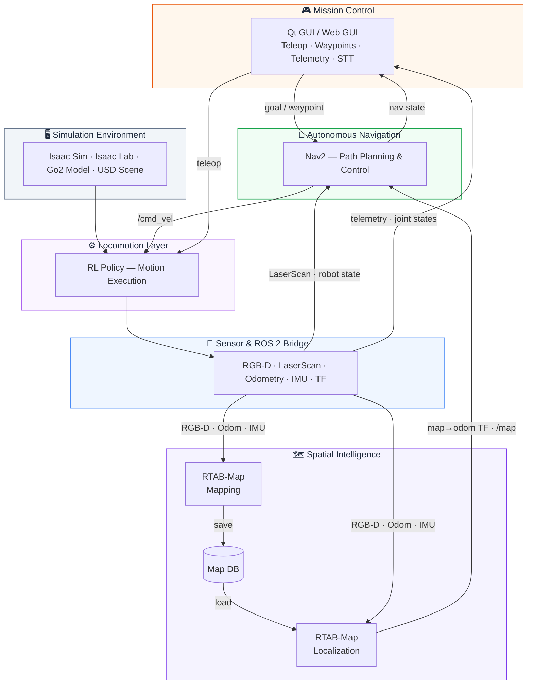

<div align="center">
  
  <h1>Go2 Intelligence Framework</h1>
  
  
  
  
  
  
  <p>ROS 2 & Isaac Sim based intelligence framework for Unitree Go2.</p>
</div>

---

## 🎯 Overview
The **Go2 Intelligence Framework** is an end-to-end quadruped autonomy framework for the Unitree Go2 robot. It connects **Isaac Sim-based simulation**, **RL-based locomotion execution**, **ROS 2 sensor streaming**, **RTAB-Map SLAM/localization**, **Nav2 autonomous navigation**, **GUI-based mission control**, and **physical Go2 deployment** into one reusable pipeline.

The focus is not only on moving a robot in simulation. The project is structured around a complete autonomy data flow: simulated robot and sensors generate ROS 2 streams, RTAB-Map builds and reuses a map database for localization, Nav2 consumes the localized pose and map to execute goals, and the GUI layer acts as the operator-facing mission control interface for simulation and real hardware.

---

## 📑 Table of Contents
- [🎯 Overview](#-overview)
- [🏛️ System Architecture](#️-system-architecture)
- [🗺️ Project Roadmap](#️-project-roadmap)
- [🛠️ Prerequisites](#️-prerequisites)
- [⚙️ Installation & Setup](#️-installation--setup)
- [📂 Project Structure](#-project-structure)
- [🏗️ Modules](#️-modules)
  - [0. Environment Setup](#0-environment-setup-map-customization)
  - [1. Basic Robot Simulation](#1-basic-robot-simulation-manual-control)
  - [2. 3D SLAM](#2-3d-slam-rtab-map-in-isaac-sim)
  - [3. Autonomous Navigation](#3-autonomous-navigation-nav2)
  - [4. GUI Controller / Mission Control](#4-gui-controller--mission-control)
  - [5. Real-world Deployment](#5-real-world-deployment)
- [🤝 Acknowledgements](#-acknowledgements)
- [📄 License](#-license)

---

## 🏛️ System Architecture

The framework is organized as a layered autonomy stack rather than a collection of independent demos. Each layer has a clear input/output contract, and the same ROS 2-centered workflow is reused from simulation to real Go2 deployment.



---

## 🗺️ Project Roadmap
This project aims to build a comprehensive intelligence framework for the Unitree Go2 robot through a phased development approach.

- [x] **Phase 1: 3D SLAM & Simulation (Completed)**
  - RTAB-Map integration with Isaac Sim visual/depth sensors.
  - Point cloud mapping and automated map database management.
- [x] **Phase 2: Autonomous Navigation (Completed)**
  - Integration with ROS 2 Nav2 stack for autonomous waypoint tracking.
  - Dynamic obstacle avoidance and optimized Nav2 parameter tuning.
- [x] **Phase 3: Intelligent GUI & Mission Control (Completed)**
  - Real-time telemetry dashboard & Live joint visualization.
  - Interactive mission planning with automated waypoint bridging.
  - Support for **STT (Speech-to-Text) & Natural Language Commands** (Predefined matching).
  - **HTML Web GUI** browser-based controller (no Qt dependency).
- [x] **Phase 4: Real-world Hardware Deployment (Completed)**
  - **Successful Sim2Real transfer** to physical Unitree Go2 hardware.
- [ ] **Phase 5: Advanced LLM Intelligence (Next Step)**
  - Integration of LLM-based reasoning for complex instruction tracking.
  - Advanced scene understanding for autonomous task-oriented behavior.

## 🛠️ Prerequisites
Before getting started, ensure your system meets the following requirements:

- **OS**: Ubuntu 22.04 LTS
- **ROS 2**: [Humble Hawksbill](https://docs.ros.org/en/humble/Installation.html)
- **Simulator**: [NVIDIA Isaac Sim 5.1.0](https://developer.nvidia.com/isaac-sim)
- **Framework**: [NVIDIA Isaac Lab](https://isaac-sim.github.io/IsaacLab/)
- **Python**: 3.10 or 3.11
- **Conda Environment**: Recommended (See Module Quick Start for activation)

## ⚙️ Installation & Setup
1. **Clone the repository**:
   ```bash
   git clone https://github.com/leesj24601/go2_intelligence_framework.git
   cd go2_intelligence_framework
   ```
2. **Install `go2_description` (RViz dependency)**:
   RViz robot visualization requires a `go2_description` package in your ROS workspace. Clone and build a compatible package before launching RViz features.
   - [go2_description](https://github.com/Unitree-Go2-Robot/go2_description) — direct RViz dependency for this project
   - [unitree_ros](https://github.com/unitreerobotics/unitree_ros) — ROS1 repo that includes description/Gazebo assets
3. **Initialize rosdep if needed**:
   ```bash
   sudo rosdep init
   rosdep update
   ```
   Skip this step if `rosdep` is already initialized on your machine.
4. **Install Python-only dependencies**:
   ```bash
   /usr/bin/python3 -m pip install --user -r requirements.txt
   ```
5. **Install ROS dependencies with rosdep**:
   ```bash
   source /opt/ros/humble/setup.bash
   rosdep install --from-paths src --ignore-src -r -y
   ```
   This reads both `go2_gui_controller` and `go2_project_dependencies` under `src/`.
6. **GUI Controller Setup (Mandatory)**:
   Before running the interactive controller for the first time, you need to set up and build the GUI package in a separate workspace:
   - **Create an external workspace and link the package**:
     ```bash
     cd ~
     mkdir -p go2_gui_controller_ws/src
     ln -s ~/go2_intelligence_framework/src/go2_gui_controller ~/go2_gui_controller_ws/src/
     ```
   - **Build the package**:
     ```bash
     cd ~/go2_gui_controller_ws
     source /opt/ros/humble/setup.bash
     colcon build --packages-select go2_gui_controller
     ```
7. **Source your ROS environments in each ROS terminal before running commands**:
   ```bash
   source /opt/ros/humble/setup.bash
   source ~/go2_description_ws/install/setup.bash
   source ~/go2_gui_controller_ws/install/setup.bash
   ```

---

## 📂 Project Structure
```text
go2_intelligence_framework/
├── assets/             # Isaac Sim assets, sample USD environments, hero image
├── config/             # Configuration files for Nav2, RViz, GUI waypoints
├── docs/               # Planning, references, and troubleshooting notes
├── launch/             # ROS 2 launch files for SLAM and Navigation
├── maps/               # Map databases (RTAB-Map .db files)
├── policies/           # Pre-trained RL policies used by the locomotion layer
├── scripts/            # Core simulation, environment, and GUI launcher scripts
└── src/                # ROS 2 packages including GUI controller dependencies
```

---

> [!IMPORTANT]
> **Execution Rule**: All commands listed below must be executed within the project's root directory (`~/go2_intelligence_framework`) unless otherwise specified.

## 🏗️ Modules

### 0. Environment Setup (Map Customization)
Both the SLAM and Navigation modules run within the same Isaac Sim environment. By default, the environment relies on a specific USD map file.

#### Creating a Custom Map (USD)
If you need to create your own simulation environment from scratch, you can build it within Isaac Sim:

<div align="center">
  <a href="https://youtu.be/74RLkOWZLKo">
    
  </a>
  <p><i>Click the image to watch the map creation demonstration in action.</i></p>
</div>

1. Open up **NVIDIA Isaac Sim**.
2. Build your environment (add ground planes, walls, and obstacles).
3. Make sure all static colliders and ground geometry are grouped logically (for instance, under a single `/World/ground` prim).
4. Save the scene as a `.usd` file (e.g., `custom_map.usd`).
> 💡 **Automation Tip**: Alternatively, you can use **Isaac Sim MCP** with an AI assistant to automatically generate and build your 3D environment without manual placement.

#### Applying your Custom Map
To change the simulation map to your own custom USD file, you need to modify the `scripts/my_slam_env.py` file. Open the script and update the `usd_path` variable under the `MySlamEnvCfg` class:

```python
# scripts/my_slam_env.py
@configclass
class MySlamEnvCfg(UnitreeGo2RoughEnvCfg):
    def __post_init__(self):
        super().__post_init__()

        # Change the usd_path to your custom map's location
        self.scene.terrain = TerrainImporterCfg(
            prim_path="/World/ground",
            terrain_type="usd",
            usd_path="/absolute/path/to/your/custom_map.usd", # <-- Update this line
            # ...
        )
```
> 💡 **Tip**: Make sure your custom USD file contains a proper `/World/ground` prim or adjust the `mesh_prim_paths` in the environment script. This is essential for proper physics collision and ensures the robot and sensors can interact with the environment correctly.

---

### 1. Basic Robot Simulation (Manual Control)
Before running SLAM or Navigation, you can explore your mapped environment by manually driving the Go2 robot. 

> 🧠 **Locomotion Layer**: The Go2 uses a reinforcement learning policy trained via the `unitree_rl_lab` framework as its low-level mobility base. In this project, the policy is treated as the motion execution layer that enables higher-level SLAM, localization, navigation, and mission-control modules to operate on top of a walking quadruped. You can swap in your own custom-trained policy by replacing the file in the `policies/` directory, provided the policy network structure matches.

#### 🎥 Demonstration Video
<div align="center">
  <a href="https://youtu.be/QgS4_h3jBiM">
    
  </a>
  <p><i>Click the image to watch the manual control demonstration in action.</i></p>
</div>

#### 🚀 How to Run
To run the basic simulation and control the robot with your keyboard:

```bash
conda activate <isaacsim_env_name>
python scripts/go2_sim.py
```

> **Controls**: Use `W`, `A`, `S`, `D` to move and `Q`, `E` to rotate the robot.

---

### 2. 3D SLAM (RTAB-Map in Isaac Sim)
Demonstrates 3D environmental mapping using RTAB-Map with the Go2 robot within the NVIDIA Isaac Sim environment.

**Role in the pipeline**:
- **Input**: RGB-D/depth sensing, LiDAR or point cloud streams, odometry, and TF from the Isaac Sim/ROS 2 bridge.
- **Mapping output**: a 3D map and `maps/rtabmap.db` database.
- **Localization output**: a pose estimate against the saved `maps/rtabmap_ground_truth.db` map for downstream Nav2 navigation.

#### 🎥 Demonstration Video
<div align="center">
  <a href="https://youtu.be/ZbYe7EWJfB8">
    
  </a>
  <p><i>Click the image to watch the RTAB-Map SLAM demonstration in action.</i></p>
</div>

> 💾 **Map Database Lifecycle**:
> - **Mapping Mode**: RTAB-Map builds the environment map from ROS 2 sensor streams and saves it at `maps/rtabmap.db`.
> - **Auto-Overwrite**: `maps/rtabmap.db` is **overwritten** every time Mapping Mode is restarted.
> - **Map Promotion**: Once the map is satisfactory, rename `maps/rtabmap.db` to **`maps/rtabmap_ground_truth.db`**.
> - **Localization Mode**: RTAB-Map automatically loads `maps/rtabmap_ground_truth.db`, estimates the robot pose against that known map, and provides the localization state used by Nav2.

#### 🚀 How to Run
To run the full simulation and SLAM pipeline, please open three separate terminals.

**Terminal A**: Start the Go2 simulation environment
```bash
conda activate <isaacsim_env_name>
python scripts/go2_sim.py
```

**Terminal B**: Launch the RTAB-Map node
- **Mapping Mode** (for creating a new map):
```bash
ros2 launch launch/go2_rtabmap.launch.py
```
- **Localization Mode**:
```bash
ros2 launch launch/go2_rtabmap.launch.py localization:=true
```

**Terminal C**: Open RViz Visualization
```bash
rviz2 -d config/go2_sim.rviz
```

> 💡 **Tip**: In Localization Mode, successful localization is confirmed when the red laser scan lines perfectly align with the generated map in RViz.

---

### 3. Autonomous Navigation (Nav2)
Integration with ROS 2 Nav2 stack for autonomous waypoint navigation and obstacle avoidance within the mapped environment.

**Role in the pipeline**:
- **Input**: `maps/rtabmap_ground_truth.db`, localized pose from RTAB-Map, live obstacle/state streams, and a goal pose from RViz or the GUI.
- **Output**: planned path, controller output, velocity command, and waypoint tracking result for the Go2 locomotion layer.

#### 🎥 Demonstration Videos

**1. Autonomous Waypoint Navigation**
<div align="center">
  <a href="https://youtu.be/J8-3K4dXg9A">
    
  </a>
  <p><i>Click the image to watch the Nav2 autonomous navigation in action.</i></p>
</div>

**2. Unmapped Static Obstacle Avoidance**
<div align="center">
  <a href="https://youtu.be/W1dHQUZ_irs">
    
  </a>
  <p><i>Click the image to watch the robot avoid unmapped static obstacles in real-time.</i></p>
</div>

> 🗺️ **Map Dependency**: The Nav2 module is pre-configured to automatically load the map from **`maps/rtabmap_ground_truth.db`**. Please ensure you have completed the mapping process and renamed your database file as described in the SLAM section before running navigation.

#### 🚀 How to Run
To run the Nav2 autonomous navigation, follow these steps in separate terminals.

**Terminal A**: Start the Go2 simulation environment
```bash
conda activate <isaacsim_env_name>
python scripts/go2_sim.py
```

**Terminal B**: Launch the Nav2 stack
```bash
ros2 launch launch/go2_navigation.launch.py
```

**Terminal C**: Open RViz Visualization
```bash
rviz2 -d config/go2_sim.rviz
```

> 💡 **Tip for Successful Navigation**:
> 1. **Confirm Localization First**: Successful localization is confirmed when the **red laser scan lines** perfectly align with the generated map in RViz.
> 2. **Issue Goal**: Use the `2D Goal Pose` in RViz only after localization is stable.

---

### 4. GUI Controller / Mission Control

#### 🎥 Demonstration Video
<div align="center">
  <a href="https://youtu.be/42z0Bue8SZ8">
    
  </a>
  <p><i>Click the image to watch the Complete Mission Control Dashboard & Autonomous Navigation demonstration.</i></p>
</div>

#### 🎮 Mission Control Interface
In addition to RViz's `2D Goal Pose`, you can use the **GUI Controller** as a mission-control layer for robot operation, runtime stack management, mission planning, and real-time monitoring.

**Role in the pipeline**:
- **Input**: telemetry, robot state, joint states, map/localization state, and Nav2 runtime state.
- **Output**: teleoperation commands, waypoint/goal commands, predefined text/STT commands, and SLAM/Navigation/RViz runtime stack control.

The project now provides **two controller frontends**:

- **Qt GUI (`gui_controller`)**: the original desktop controller with charts and the existing workflow.
- **HTML Web GUI (`web_controller`)**: a new browser-based controller that removes the Qt runtime dependency for day-to-day operation and is easier to debug remotely from the same PC.

> 🛠️ **Optimization Note**: After running the basic simulation (`python scripts/go2_sim.py`), **all other terminal-based launch commands** (SLAM, Navigation, etc.) can be fully replaced and managed through this GUI dashboard for a more streamlined experience.

*   **Intuitive Teleoperation**: Direct control via GUI buttons.
*   **Real-time Telemetry Dashboard**: Monitor the robot's state in real-time. Live joint value charts are available in the Qt GUI.
*   **Mission Planning**: Set waypoints and monitor robot status in real-time.
*   **Natural Language Commands (Current)**: Support for predefined simple commands via text or **STT (Speech-to-Text)** voice input to automatically set corresponding waypoints via the GUI bridge.
*   **Runtime Stack Control**: Start/stop SLAM, Navigation, and RViz directly from the controller. SLAM and Navigation are intentionally managed as **mutually exclusive** runtime stacks.

#### 🚀 How to Run (Qt GUI)
While `go2_sim.py` is running, open a new terminal and launch the original Qt GUI controller:

```bash
bash scripts/run_gui_controller.sh
```

#### 🌐 How to Run (HTML Web GUI)
While `go2_sim.py` is running, open a new terminal and launch the browser-based controller:

```bash
# Simulation mode
ros2 launch go2_gui_controller go2_web_controller.launch.py mode:=sim

# Real robot mode
# ros2 launch go2_gui_controller go2_web_controller.launch.py mode:=real
```

Then open:

```text
http://127.0.0.1:8080
```

---

### 5. Real-world Deployment
This section showcases the implementation of the framework on the physical Unitree Go2 robot, demonstrating the robustness of the SLAM and navigation systems outside of the simulation.

The Sim2Real stage is designed around software-layer reuse rather than a one-off hardware demo. The deployment path preserves the core autonomy stack while replacing simulation-specific interfaces with hardware-facing ones:

- **Locomotion policy/interface transfer** from the simulated mobility base to the physical Go2 execution path.
- **ROS 2 autonomy stack reuse** for RTAB-Map, localization, Nav2, and mission-control communication.
- **Sensor interface replacement** from Isaac Sim streams to real robot sensors while keeping the mapping/localization/navigation workflow consistent.
- **Map/localization pipeline validation** on real-world sensor data.
- **Mission control interface reuse** through the same GUI launcher and operator workflow.

> 💡 **Reference (LiDAR-based SLAM)**: For an alternative implementation using **4D LiDAR L1** for RTAB-Map, please refer to the following repository: [Go2_L1_Lidar_Rtabmap](https://github.com/ctrlcvlab/Go2_L1_Lidar_Rtabmap)

#### 🎥 Real-world 3D SLAM (RTAB-Map) Execution
<div align="center">
  <a href="https://youtu.be/naLCEioS-cA">
    
  </a>
  <p><i>Click the image to watch the <b>3D SLAM (RTAB-Map)</b> running on the real Unitree Go2 hardware.</i></p>
</div>

#### 🚀 How to Run
Ensure the physical Go2 is connected and the ROS 2 network is configured. The onboard camera must also be enabled — in this setup, the camera was activated via SSH into the robot and launched through ROS 2.

```bash
bash scripts/run_gui_controller.sh
```

## 🤝 Acknowledgements
This project leverages several open-source libraries and frameworks:
- [Unitree Robotics](https://www.unitree.com/) for the Go2 robot and [Unitree RL Lab](https://github.com/unitreerobotics/unitree_rl_lab).
- [NVIDIA Isaac Sim](https://developer.nvidia.com/isaac-sim) for the simulation platform.
- [RTAB-Map](http://introlab.github.io/rtabmap/) for SLAM and mapping.
- [Nav2 (Navigation 2)](https://navigation.ros.org/) for autonomous navigation.
- The [ROS 2](https://www.ros.org/) community for providing the robust robotics middleware.

## 📄 License
This project is licensed under the [Apache License 2.0](LICENSE). 
You may use, modify, and distribute this software under the terms of the Apache 2.0 license. This provides additional protections for both the original authors and the users, including patent grants and mandatory attribution for modifications.
