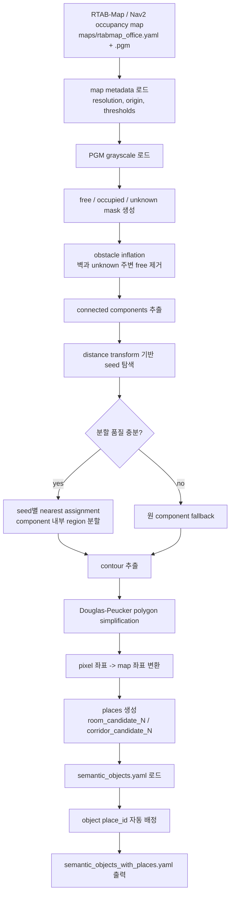
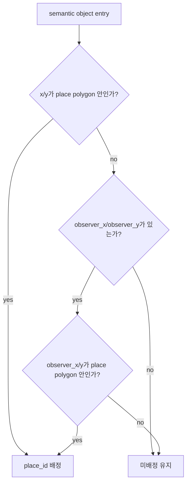
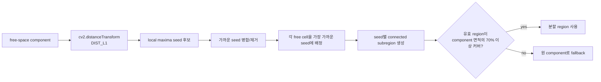
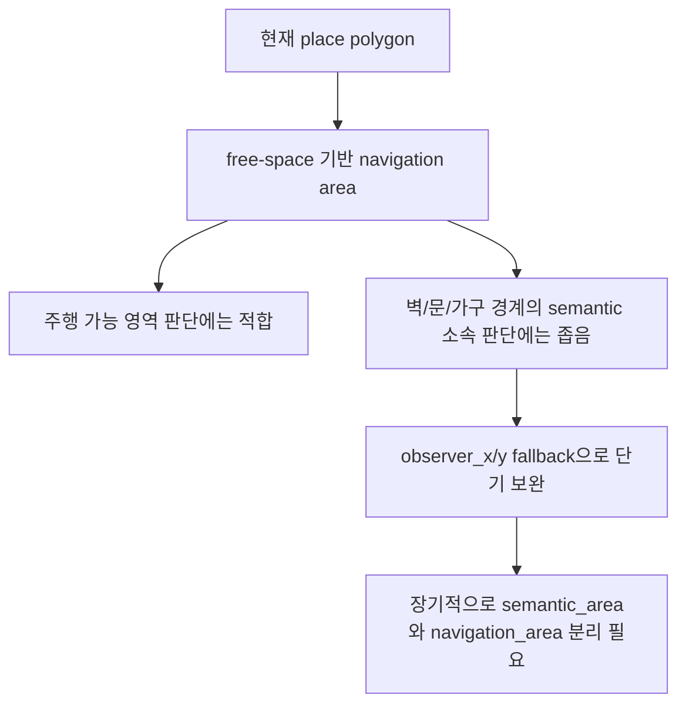

# Semantic Place Pipeline Workflow

> 작성일: 2026-05-21  
> 기준 워크스페이스: `/home/cvr/Desktop/sj/go2_intelligence_framework`

이 문서는 이번 세션에서 진행한 semantic place 자동 생성 작업의 실제 워크플로우와 현재 파이프라인을 정리한다.

---

## 현재 산출물

| 항목 | 경로 |
|------|------|
| 입력 Nav2 map YAML | `maps/rtabmap_office.yaml` |
| 입력 occupancy image | `maps/rtabmap_office.pgm` |
| 입력 semantic object map | `src/go2_gui_controller/config/semantic_objects.yaml` |
| v2 place builder | `scripts/build_semantic_places_from_occupancy.py` |
| 결과 semantic map | `src/go2_gui_controller/config/semantic_objects_with_places.yaml` |
| place geometry 유틸 | `src/go2_gui_controller/go2_gui_controller/semantic_place_geometry.py` |
| place registry | `src/go2_gui_controller/go2_gui_controller/semantic_place_registry.py` |

현재 실제 맵 실행 결과:

```text
places: 1
objects: 74
assigned_objects: 74
unassigned_objects: 0
```

---

## 전체 흐름



---

## 객체 소속 배정 규칙

초기 배정은 `object.x`, `object.y`가 place polygon 안에 있을 때만 성공했다. 실제 맵에서는 벽에 붙은 TV, 화분, 벤치 같은 객체 중심점이 occupied cell 또는 inflated obstacle 영역에 있어 미배정이 발생했다.

현재 규칙은 다음 순서다.



핵심 판단:

- `x/y`는 물체 중심점이라 벽, 가구, 장애물 셀 위에 놓일 수 있다.
- `observer_x/y`는 그 물체를 관측한 로봇 위치라 대부분 free-space에 있다.
- 따라서 현재 단계에서는 polygon을 임의로 벽 바깥까지 키우는 것보다 `observer_x/y` fallback이 더 안전하다.

---

## v2 분할 로직



coverage fallback을 둔 이유:

- 실제 `rtabmap_office` 맵에서는 너무 작은 seed region만 남는 경우가 있었다.
- 작은 region만 places로 저장되면 대부분 객체가 place 밖으로 빠진다.
- 유효 분할 region들이 원 component의 충분한 면적을 덮지 못하면 원 component를 유지한다.

---

## 실행 명령

현재 실제 맵 결과를 재생성하는 명령:

```bash
python3 scripts/build_semantic_places_from_occupancy.py \
  --map-yaml maps/rtabmap_office.yaml \
  --semantic-input src/go2_gui_controller/config/semantic_objects.yaml \
  --output src/go2_gui_controller/config/semantic_objects_with_places.yaml \
  --min-region-area-m2 1.0 \
  --inflate-cells 1
```

테스트:

```bash
python3 -m unittest discover src/go2_gui_controller/test
```

현재 확인 결과:

```text
Ran 20 tests ... OK
```

---

## 현재 한계



현재 `rtabmap_office`에서는 `room_candidate_1` 하나가 큰 free-space component를 대표한다. 객체 소속은 전부 배정되지만, 실제 방 단위 이름 구분은 아직 되지 않는다.

장기적으로는 place를 두 영역으로 분리하는 것이 맞다.

```yaml
places:
  room_candidate_1:
    navigation_polygon: [...]
    semantic_polygon: [...]
```

- `navigation_polygon`: Nav2 goal 검증과 주행 가능성 판단용 free-space 영역
- `semantic_polygon`: 벽/문/경계 주변 객체 소속 판단용 의미 영역

현재 단계에서는 room 분할 품질이 아직 충분하지 않기 때문에 `semantic_polygon` 확장보다 `observer_x/y` fallback을 우선 적용했다.

---

## 세션에서 결정한 방향

1. 임시 `/tmp/go2_intelligence_framework-semantic-place-v1` 작업 복제본은 삭제했다.
2. 이후 작업은 원래 워크스페이스 `/home/cvr/Desktop/sj/go2_intelligence_framework`에서 진행한다.
3. 실제 맵 `rtabmap_office` 기준 place 자동 생성은 동작한다.
4. 객체 소속 배정은 `x/y -> observer_x/y fallback` 순서로 한다.
5. 현재 결과는 `74/74` 객체가 `place_id`를 갖는다.
6. 다음 품질 개선은 하나의 큰 `room_candidate_1`을 실제 room/corridor 단위로 안정적으로 나누는 것이다.
